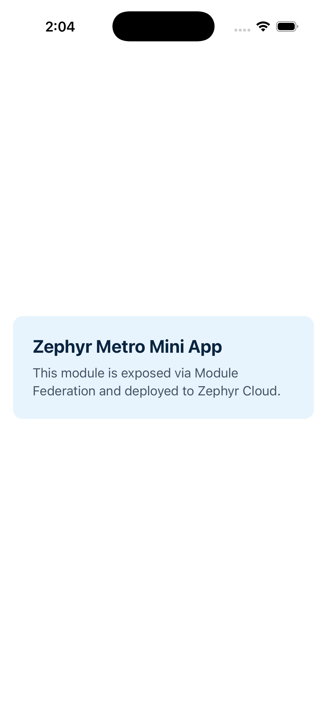

# Zephyr React Native (Metro)

A React Native 0.86 mini application integrated with [Zephyr Cloud](https://zephyr-cloud.io) via the [Metro bundler plugin](https://docs.zephyr-cloud.io/bundlers/metro). It exposes a Module Federation remote and deploys bundles through Zephyr's default Cloud integration.



## Live deployment

| | |
|---|---|
| **Zephyr app** | `zephyrreactnative.zephyrreactnative.luis-sanchez` |
| **Dashboard** | [app.zephyr-cloud.io](https://app.zephyr-cloud.io/) |
| **Preview URL** | https://luisanchez9821-7-zephyrreactnative-zephyrreactnat-40d3cc006-ze.zephyrcloud.app |
| **Exposed module** | `./example` → `src/example.tsx` |
| **Platform bundled** | iOS (`dist/ios/`) |

After `npm run bundle:ios`, Zephyr uploads an immutable snapshot to the edge. New versions show up in the dashboard under the application above.

## Quick start

### Prerequisites

- Node.js >= 22
- Ruby >= 3.3.2 (for CocoaPods)
- Xcode + iOS Simulator (or Android Studio)
- [Zephyr Cloud account](https://app.zephyr-cloud.io/)
- Git repository with a remote `origin` (required for production deployments)

### Install

```bash
npm install
cd ios && bundle install && bundle exec pod install && cd ..
```

### Run locally

```bash
npm start
npm run ios     # or: npm run android
```

Dev mode uses **plain Metro** (no Module Federation) so the mini app runs standalone on the simulator. Module Federation + Zephyr activate only for deploy via `ZC=1` (set automatically by the bundle scripts).

`App.tsx` renders the exposed `Example` component directly. In a host/remote setup, a host would lazy-load `import('zephyrreactnative/example')` instead.

### Deploy to Zephyr Cloud

```bash
npm run bundle:ios
# or
npm run bundle:android
```

On first run, Zephyr prompts you to sign in (browser OAuth at [app.zephyr-cloud.io](https://app.zephyr-cloud.io/)). After auth, the build continues and uploads automatically. Confirm the new version in the [dashboard](https://app.zephyr-cloud.io/).

## How Zephyr fits into the React Native build pipeline

```
Source (App.tsx, src/example.tsx)
        │
        ▼
Metro bundler ──► @module-federation/metro  (MF container + exposes)
        │
        ▼
zephyr-metro-plugin  (hooks build lifecycle)
        │
        ├── bundle-mf-remote CLI  (react-native.config.js)
        │         │
        │         ▼
        │   dist/ios/*.bundle + mf-manifest.json
        │
        ▼
Zephyr agent  (auth, fingerprint, upload)
        │
        ▼
Zephyr Cloud edge  (immutable version, preview URL)
```

**Metro** remains the bundler — it transforms TypeScript/JSX, resolves modules, and produces platform bundles. **Module Federation** (`@module-federation/metro`) adds a container entry and manifest so other apps can consume exposed modules at runtime.

**`zephyr-metro-plugin`** wraps Metro via `withZephyr()`. During `bundle-mf-remote`, it:

1. Authenticates with Zephyr Cloud (browser OAuth or `ZE_SECRET_TOKEN`)
2. Fingerprints build output
3. Uploads assets to Zephyr's Cloudflare-backed edge
4. Registers an immutable version you can promote, tag, or roll back

Typical production shape:

- **Mini apps (remotes)** — like this repo — expose feature modules and deploy independently
- **Host apps** — declare `remotes` in Metro config and `zephyr:dependencies` in `package.json` so Zephyr resolves remote URLs by environment (`staging`, `production`) instead of hard-coded localhost ports

That lets teams ship a feature without a full app-store release, with instant rollbacks from the Zephyr dashboard.

## Project structure

```
├── App.tsx                  # Shell that renders the exposed module
├── src/example.tsx          # Module Federation expose (./example)
├── metro.config.js          # Plain Metro for dev; loads zephyr config when ZC=1
├── metro.zephyr.config.js   # withZephyr + withModuleFederation (deploy only)
├── react-native.config.js   # bundle-mf-remote CLI + Zephyr upload wrapper
└── dist/ios/                # Generated bundles (gitignored)
```

## Key dependencies

| Package | Role |
|---------|------|
| `zephyr-metro-plugin` | Zephyr Cloud deploy hook for Metro |
| `@module-federation/metro` | Module Federation for React Native |
| `@module-federation/metro-plugin-rnc-cli` | `bundle-mf-remote` CLI command |
| `@module-federation/runtime` | MF runtime shared deps |

## Developer experience & documentation feedback

### What worked well

- **Browser OAuth** — Press Enter, complete login, and the build resumes. The greeting and app UID (`zephyrreactnative.zephyrreactnative.luis-sanchez`) make the deploy target obvious.
- **Single-command deploy** — `npm run bundle:ios` bundles and uploads; no separate upload step.
- **MF mapping** — Mini-app `exposes` / `shared` / `shareStrategy` maps cleanly from web Module Federation docs to Metro.

### Pain points

1. **Version skew in docs** — The [Metro guide](https://docs.zephyr-cloud.io/bundlers/metro) references React 19.1.0 / RN 0.80.0. This project uses RN 0.86 / React 19.2.3. Latest packages without pinning hit a peer conflict (`@module-federation/metro@2.8.0` vs `^0.21.6`). Pinning to `@module-federation/metro@0.21.6` fixed it — docs should publish compatible version sets.
2. **`npx zephyr login` doesn't exist** — Docs reference it, but there is no `zephyr` npm binary. Auth happens inline on the first `bundle-mf-remote` run. `zephyr-cli` (`ze-cli`) is a build runner, not a login tool.
3. **Git remote required** — Zephyr warns loudly (but still builds) when no `origin` remote exists. A clearer "dev mode" vs "production mode" distinction would help.
4. **Host + remote complexity for first deploy** — The tutorial assumes a two-app monorepo. For "deploy my first RN app," the mini-app-only path is simpler but buried under host/remote architecture docs.
5. **`server.tls` validation warning** — Metro logs `Unknown option "server.tls"` on every run.
6. **RUNTIME-006 in dev** — Standalone mini apps with MF + `eager: false` shared deps hit `loadShareSync` errors. Splitting dev (plain Metro) from deploy (`ZC=1` + MF) fixes this; docs don't cover that single-app pattern.

### Suggestions

- Publish a **compatibility matrix** (RN ↔ MF metro ↔ zephyr-metro-plugin)
- Provide a **`npx create-zephyr-apps` or `with-zephyr` codemod** tested against the latest RN template
- Document that **auth is inline** during bundle, not a separate login command
- Lead with a **minimal single-app quickstart** before the full host/remote tutorial
- Explain **dev vs deploy Metro config** for standalone mini apps (avoid RUNTIME-006)

## License

Private assessment project.
